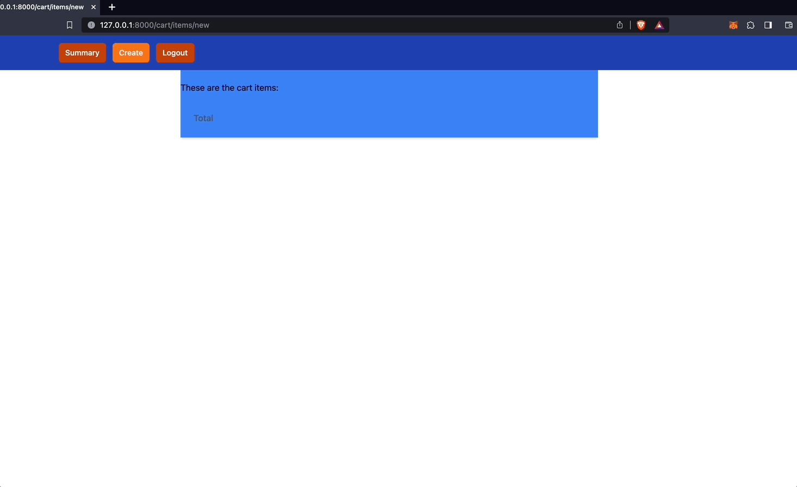

# djangoTailwindCartApp
 Simple Cart App using django and tailwind

# Intsructions

Run Server
 ```
 python3 manage.py runserver
 ```

# Demo

Registration and Login


Add Items


Edit, Delete an Item and logout
 


